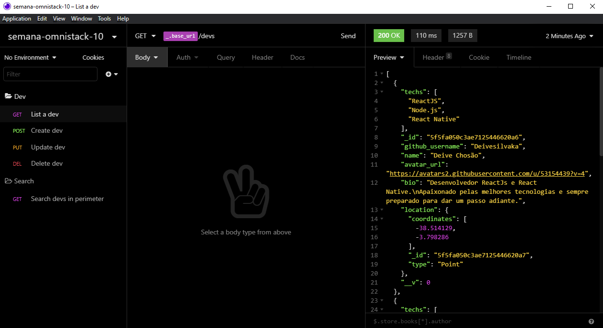

<h1 align="center">
    
</h1>

    

## :rocket: Tecnologias 
Fora usadas as seguintes tecnologias:

- [Node.js](https://nodejs.org/en/)
- [React](https://reactjs.org)
- [React Native](https://reactnative.dev)
- [Expo](https://expo.io)

## :computer: Projeto

Desenvolvido durante a 10º edição da Semana Omnistack pela [Rocketseat](https://rocketseat.com.br), tem como objetivo conectar desenvolvedores próximos a você que trabalham com as mesmas tecnologias, e além disso mostrar o poder da stack do JavaScript, construindo o backend em Node.js, o frontend web em ReactJS e o mobile em React Native.

## :thinking: Como acessar a API?

<h1 align="center">
    
</h1>

Baixo o [Insomnia](https://insomnia.rest), clique em `Application > Preferences > Data > Import Data > From URL`, e cole a seguinte url `https://github.com/erik-ferreira/semana-omnistack-10/blob/main/Insomnia_2021-02-08.json`